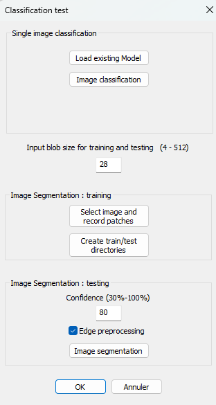

# DeepCnn
C++ Libtorch  based Interface for creation of convolutional neural network, train and test image classification, without python

Alpha test of a Windows exe  

SOURCE CODE WILL BE UPLOADED SOON !

# Third party dll are available here  
compiled version of Opencv version 4.10  
[decid 3D 2025_7001_release/opencv_world4100.dll](https://github.com/Karleener/Decid3D/blob/4c91c6335469a6f224ab6f51e2e41a1fe3e66ba3/decid%203D%202025_7001_release/opencv_world4100.dll)  
Libtorch 2.6 for windows, with cuda 12.6  
https://download.pytorch.org/libtorch/cu126/libtorch-win-shared-with-deps-2.6.0%2Bcu126.zip

Copy all DLL files (from Lib subdirectory of libtorch) in the same directory as DeepCnn2025.exe  

# Install visual c++ 2022 redistribuable  
https://learn.microsoft.com/en-us/cpp/windows/latest-supported-vc-redist?view=msvc-170

# Run DeepCnn2025.exe 

# Run configuration to create a network structure and save it (.configCNN file)  

Train the network selecting configCNN file and data directory structure including train and test subdirectories as follows  
(see sampledata.zip provided)  

 directory\train\classe1\image1.jpg  
 directory\train\classe1\image2.jpg  
 ...  
 directory\train\classe2\image1.jpg  
 directory\train\classe2\image1.jpg 
 directory\test\classe1\image1.jpg  
 directory\test\classe1\image2.jpg  
 ...  
 directory\test\classe2\image1.jpg  
 directory\test\classe2\image1.jpg  

 

# Wait for training completion (press F5 to stop the process)

 

# Save training result as .pt file

# Test image classification selecting one of the test image.
 
 It is possible to classify one single image or to create/label patches from images in order to create a train/test directory structure
Choose the blob size Clic on Select image and record patches - select saving folder.  
Open the training image containing objects to be localized.  
Left clic on several patches of the background (class 0) Right clic to increment the class number, then left clic on the patches of the current class
Repeat the process for several classes. Close the training image.  
Clic on "Create train/test directories" and select the folder where you stored the patches.  
Close the Classification test dialog box and train your CNN.  
Open Classification test, choose the blob size and the image to be segmented.   
Segmented image (_segmented.png) and list of detected patches (csv file) are automatically saved.

